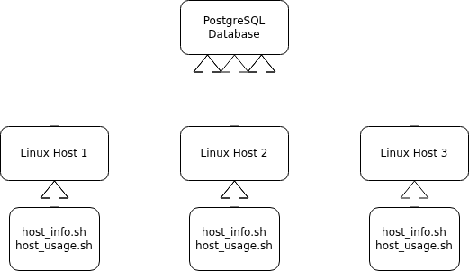

# Linux Cluster Monitoring Agent

# Introduction
This project is a Linux cluster monitoring MVP designed for the Jarvis Cluster Administration team. Its purpose is to collect hardware
specifications and real-time resource usage data, such as CPU and memory consumption,
from Linux servers and store the information in a relational database for future reporting
and capacity planning. The main users are the LCA team and developers who need to monitor node
performance and support infrastructure decisions. The system follows a simple architecture: 
one Bash script collects static host information at installation time, while another gathers
dynamic usage data at regular intervals through cron. A PostgreSQL database is used to persist
the collected data, and users can query it with SQL for analysis. The project is built using Bash,
PostgreSQL, Docker, crontab, Git, GitHub, and Linux command-line tools.


# Quick Start
The followings are quick-start commands for this project
- Start a psql instance using psql_docker.sh
```bash
bash ./scripts/psql_docker.sh start | stop | create db_username db_password
```

- Create tables using ddl.sql
```bash
export PGPASSWORD='db_password'
psql -h localhost -U postgres -d host_agent -f sql/ddl.sql
```

- Insert hardware specs data into the DB using host_info.sh
```bash
bash ./scripts/host_info.sh psql_host psql_port db_name psql_user psql_password
```

- Insert hardware usage data into the DB using host_usage.sh
```bash
bash ./scripts/host_usage.sh psql_host psql_port db_name psql_user psql_password
```

- Crontab setup
```bash
crontab -e

# within crontab
* * * * * bash /home/centos/dev/jrvs/bootcamp/linux_sql/host_agent/scripts/host_usage.sh localhost 5432 host_agent postgres password > /tmp/host_usage.log
```


# Implementation
This project is implemented as a lightweight Linux monitoring pipeline built
with **Bash**, **PostgreSQL**, **Docker**, **Git**, and **Crontab**. The system is divided into 
two main data collection tasks.  

The first task is handled by ```host_info.sh```, which gathers static hardware
information from the host machine, such as CPU architecture, model, number of
cores, and total memory. This script runs once during setup and inserts the data
into host_info table.

The second task is handled by ```host_usage.sh```, which collects dynamic system 
usage metrics such as CPU idle percentage, memory availability, disk usage, and 
current timestamp. This script is scheduled through crontab to run every minute
and insert records into the ```host_usage``` table.

A **PostgreSQL** database running inside a **Docker** container is used to store all 
monitoring data. The schema is created with ```ddl.sql``` which defines the
relational structure and constraints between tables. **Git** and **GitHub** are used 
for version control and project management. This design keeps the system simple,
modular, and easy to deploy on any Linux server.
## Architecture


## Scripts
Shell script description and usage
- psql_docker.sh  
This script is used to start, stop, create a PostgreSQL Docker container for
the project database. You can use it to quickly set up the database without 
installing PostgreSQL directly on your local machine.  

Usage:
```bash
bash ./scripts/psql_docker.sh start|stop|create dbusername db_password
```
- host_info.sh  
This script collects static hardware information from the Linux host, such as
hostname, CPU number, CPU architecture, CPU model, and total memory. This kind
of data usually does not change often, so this script is normally run once during
setup.  

Usage:
```bash
bash ./scripts/host_info.sh psql_host psql_port db_name psql_user psql_password
```
- host_usage.sh  
This script collects static hardware information from the Linux host, such as
hostname, CPU usage, memory usage, available disk space, and the current timestamp.
Because this data changes all the time, this script is meant to run repeatedly.  

Usage:
```bash
bash scripts/host_usage.sh psql_host psql_port db_name psql_user psql_password
```
- Crontab  
**Crontab** is used to schedule ```host_usage.sh``` to run automatically every minute.
This allows the project to keep collecting fresh usage data without needing to
run the script manually each time.

Usage:
```bash
# Open crontab
crontab -e

# list crontab jobs
crontab -l

# validate result from the psql instance
psql -h localhost -U postgres -d host_agent -f sql/ddl.sql
> SELECT * FROM host_usage;
```
- queries.sql  
This file is used to answer simple business questions from the monitoring data stored
in the database. We will use SQL queries to turn raw records into useful information.

## Database Modeling
- `host_info`

| Column Name      | Type             | Description                               |
|------------------|------------------|-------------------------------------------|
| id               | SERIAL NOT NULL  | Unique ID for each host                   |
| hostname         | VARCHAR NOT NULL | Host machine name                         |
| cpu_number       | INT2 NOT NULL    | Number of CPUs on the host                |
| cpu_architecture | VARCHAR NOT NULL | CPU architecture, such as x84_64          |
| cpu_model        | VARCHAR NOT NULL | CPU model name                            |
| cpu_mhz          | FLOAT8 NOT NULL  | CPU speed in MHz                          |
| l2_cache         | INT4 NOT NULL    | L2 chache size                            |
| timestamp        | TIMESTAMP NULL   | Time when the hardware info was collected |
| total_mem        | INT4 NULL        | Total memory of the host in KB            |

- `host_usage`

| Column Name             | Type            | Description                                 |
|-------------------------|-----------------|---------------------------------------------|
| host_id                 | SERIAL NOT NULL | Host ID linked to the ```host_info``` table |
| memory_free             | INT4 NOT NULL   | Free memory in MB                           |
| cpu_idle                | INT2 NOT NULL   | CPU idle percentage                         |
| cpu_kernel              | INT2 NOT NULL   | CPU usage by kernel processes               |
| disk_io                 | INT4 NOT NULL   | Number of disk I/O operations               |
| disk_available          | INT4 NOT NULL   | Available disk space in MB                  |
| timestamp               | TIMESTAMP NULL  | Time when the hardware info was collected   |

# Test
I tested the project step by step instead of trying everything at once.

For the DDL, I ran ```ddl.sql``` in **PostgreSQL** and checked whether the two tables, host_info and host_usage, were created correctly. After that, I used PostgreSQL commands like  ```host_info``` and ```host_usage``` to confirm the columns, data types, and foreign key relationship were correct.

For the Bash scripts, I tested each script separately.
First, I ran ```host_info.sh``` and checked the ```host_info``` table to make sure one row of hardware information was inserted successfully.
Then, I ran ```host_usage.sh``` and checked the ```host_usage``` table to see whether usage data was inserted correctly. I also tested the **crontab** setup to make sure ```host_usage.sh``` could run automatically every minute.

The result was that the database tables were created successfully, both scripts were able to insert data into PostgreSQL, and the scheduled job worked as expected. During testing, I also fixed issues like SQL insertion errors, script path problems, and incorrect column mapping.

# Deployment
First, I stored the whole project on **GitHub** so the code could be version-controlled and submitted properly. That includes the Bash scripts, SQL files, and README.

For the database, I used **Docker** to run a **PostgreSQL** container. This made setup easier because I did not need to install PostgreSQL directly on the Linux host. I could just create and start the database container with the script and use it as the backend for the project.

For the app logic, I used **Bash scripts** on the Linux host. ```host_info.sh``` was run once to insert the machine's hardware information, and ```host_usage.sh``` was used for collecting usage data.

To keep collecting usage data automatically, I deployed the monitoring job with **crontab**. I set it to run ```host_usage.sh``` every minute, so the database keeps getting updated without manual work.

So overall, the project was deployed with **GitHub for code management, Docker for the PostgreSQL database, and crontab for automatic data collection.**

# Improvements
- Handle hardware updates
- Add more error checks to the Bash scripts
- Improve monitoring coverage