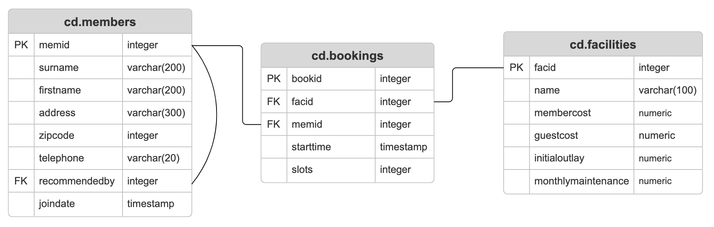

# Introduction
### What this project does
This project is a hands-on learning product designed to help trainees build practical SQL and RDBMS skills by solving a structured set of SQL query challenges. Learners work through prompts, write queries against provided tables, polish formate and validate outputs by using online websites.

### Who the users are
The primary users are trainees who need SQL for real work or interviews, including developers, data engineers, and data analysts. When stuck, learners can ask instructors and peers for support in the dedicated Slack channel.

### Technologies used
```text
- SQL / RDBMS (PostgreSQL)
- Linux CLI
- bash for command-line workflow and automation
- Docker to run the database and ensure a consistent environment
- Git for version control and tracking progress
- psql / SQL client tools to execute and test queries
```
# SQL Queries
### ERD


###### Table Setup (DDL)
```cd.members``` table
```sql
CREATE TABLE cd.members(
    memid INT NOT NULL, 
    surname VARCHAR(200) NOT NULL, 
    firstname VARCHAR(200) NOT NULL, 
    address VARCHAR(300) NOT NULL, 
    zipcode INT NOT NULL, 
    telephone VARCHAR(20) NOT NULL, 
    recommendedby INT,
    joindate TIMESTAMP NOT NULL,
    CONSTRAINT members_pk PRIMARY KEY (memid),
    CONSTRAINT fk_members_recommendedby FOREIGN KEY (recommendedby)
        REFERENCES cd.members(memid) ON DELETE SET NULL
);
```

```cd.facilities``` table
```sql
CREATE TABLE cd.facilities(
    facid INT NOT NULL, 
    name VARCHAR(100) NOT NULL, 
    membercost NUMERIC NOT NULL, 
    guestcost NUMERIC NOT NULL, 
    initialoutlay NUMERIC NOT NULL, 
    monthlymaintenance NUMERIC NOT NULL, 
    CONSTRAINT facilities_pk PRIMARY KEY (facid)
);
```

```cd.bookings``` table
```sql
CREATE TABLE cd.bookings (
    bookid INT NOT NULL,
    facid INT NOT NULL,
    memid INT NOT NULL,
    starttime TIMESTAMP NOT NULL,
    slots INT NOT NULL,
    CONSTRAINT bookings_pk PRIMARY KEY (bookid),
    CONSTRAINT fk_bookings_facid FOREIGN KEY (facid) REFERENCES cd.facilities(facid),
    CONSTRAINT fk_bookings_memid FOREIGN KEY (memid) REFERENCES cd.members(memid)
);
```
### Modifying Data:
###### Question 1: The club is adding a new facility - a spa. We need to add it into the facilities table. Use the following values: facid: 9, Name: 'Spa', membercost: 20, guestcost: 30, initialoutlay: 100000, monthlymaintenance: 800.

```sql
SELECT *
FROM cd.members;
```

###### Question 2: we want to automatically generate the value for the next facid, rather than specifying it as a constant. Use the following values for everything else: Name: 'Spa', membercost: 20, guestcost: 30, initialoutlay: 100000, monthlymaintenance: 800.

```sql
INSERT INTO cd.facilities (
    facid, name, membercost, guestcost,
    initialoutlay, monthlymaintenance
)
VALUES
    (
        (
            SELECT
                MAX(facid)
            FROM
                cd.facilities
        ) + 1,
        'Spa',
        20,
        30,
        100000,
        800
    );
```

###### Question 3: We made a mistake when entering the data for the second tennis court. The initial outlay was 10000 rather than 8000: you need to alter the data to fix the error.
```sql
UPDATE 
  cd.facilities 
SET 
  initialoutlay = 10000 
WHERE 
  name = 'Tennis Court 2'
```

###### Question 4: We want to alter the price of the second tennis court so that it costs 10% more than the first one. Try to do this without using constant values for the prices, so that we can reuse the statement if we want to.
```sql
UPDATE 
  cd.facilities 
SET 
  membercost = (
    SELECT 
      membercost 
    FROM 
      cd.facilities 
    WHERE 
      name = 'Tennis Court 1'
  ) * 1.1, 
  guestcost = (
    SELECT 
      guestcost 
    FROM 
      cd.facilities 
    WHERE 
      name = 'Tennis Court 1'
  ) * 1.1 
WHERE 
  name = 'Tennis Court 2'
```

###### Question 5: As part of a clear out of our database, we want to delete all bookings from the cd.bookings table. How can we accomplish this?
```sql
DELETE FROM 
    cd.bookings;
```

###### Question 6: We want to remove member 37, who has never made a booking, from our database. How can we achieve that?
```sql
DELETE FROM 
  cd.members 
WHERE 
  memid = 37;
```

### Basic:
###### Question 1: How can you produce a list of facilities that charge a fee to members, and that fee is less than 1/50th of the monthly maintenance cost? Return the facid, facility name, member cost, and monthly maintenance of the facilities in question.
```sql
SELECT 
  facid, 
  name, 
  membercost, 
  monthlymaintenance 
FROM 
  cd.facilities 
WHERE 
  membercost < (monthlymaintenance / 50) 
  and membercost != 0;
```

###### Question 2: How can you produce a list of all facilities with the word 'Tennis' in their name?
```sql
SELECT 
  * 
FROM 
  cd.facilities 
WHERE 
  name LIKE '%Tennis%'
```

###### Question 3: How can you retrieve the details of facilities with ID 1 and 5? Try to do it without using the OR operator.
```sql
SELECT 
  * 
FROM 
  cd.facilities 
WHERE 
  facid IN (1, 5);
```

###### Question 4: How can you produce a list of members who joined after the start of September 2012? Return the memid, surname, firstname, and joindate of the members in question.
```sql
SELECT 
  memid, 
  surname, 
  firstname, 
  joindate 
FROM 
  cd.members 
WHERE 
  joindate >= '2012-09-01 00:00:00'
```

###### Question 5: You, for some reason, want a combined list of all surnames and all facility names. Yes, this is a contrived example :-). Produce that list!
```sql
SELECT 
  surname 
FROM 
  cd.members 
UNION 
SELECT 
  name 
FROM 
  cd.facilities;
```

### Join:
###### Question 1: How can you produce a list of the start times for bookings by members named 'David Farrell'?
```sql
SELECT 
    b.starttime 
FROM 
    cd.bookings b
    JOIN cd.members m ON b.memid = m.memid
WHERE 
    m.surname = 'Farrell' 
    and m.firstname = 'David';
```

###### Question 2: How can you produce a list of the start times for bookings for tennis courts, for the date '2012-09-21'? Return a list of start time and facility name pairings, ordered by the time.
```sql
SElECT 
  b.starttime as start, 
  f.name 
FROM 
  cd.bookings b 
  JOIN cd.facilities f ON b.facid = f.facid 
WHERE 
  '2012-09-22' > b.starttime 
  and b.starttime >= '2012-09-21' 
  and f.name LIKE '%Tennis Court%' 
ORDER BY 
  b.starttime;
```

###### Question 3: How can you output a list of all members, including the individual who recommended them (if any)? Ensure that results are ordered by (surname, firstname).
```sql
SELECT 
  m1.firstname as memfname, 
  m1.surname as memsname, 
  m2.firstname as recfname, 
  m2.surname as recsname 
FROM 
  cd.members m1 
  LEFT JOIN cd.members m2 ON m1.recommendedby = m2.memid 
ORDER BY 
  m1.surname, 
  m1.firstname;
```

###### Question 4: How can you output a list of all members who have recommended another member? Ensure that there are no duplicates in the list, and that results are ordered by (surname, firstname).
```sql
SELECT 
  DISTINCT m2.firstname as firstname, 
  m2.surname as surname 
FROM 
  cd.members m1 
  JOIN cd.members m2 ON m1.recommendedby = m2.memid 
ORDER BY 
  m2.surname, 
  m2.firstname;
```

###### Question 5: How can you output a list of all members, including the individual who recommended them (if any), without using any joins? Ensure that there are no duplicates in the list, and that each firstname + surname pairing is formatted as a column and ordered.
```sql
SELECT 
  DISTINCT mems.firstname || ' ' || mems.surname AS member, 
  (
    SELECT 
      recs.firstname || ' ' || recs.surname AS recommender 
    FROM 
      cd.members recs 
    WHERE 
      recs.memid = mems.recommendedby
  ) 
FROM 
  cd.members mems 
ORDER BY 
  member;
```

### Aggregation:
###### Question 1: Produce a count of the number of recommendations each member has made. Order by member ID.
```sql
SELECT 
    recommendedby, 
    COUNT(recommendedby) 
FROM 
    cd.members
WHERE 
    recommendedby IS NOT NULL
GROUP BY 
    recommendedby
ORDER BY 
    recommendedby;
```

###### Question 2: Produce a list of the total number of slots booked per facility. For now, just produce an output table consisting of facility id and slots, sorted by facility id.
```sql
SELECT 
  facid, 
  SUM(slots) as "Total Slots" 
FROM 
  cd.bookings 
GROUP BY 
  facid 
ORDER BY 
  facid;
```

###### Question 3: Produce a list of the total number of slots booked per facility in the month of September 2012. Produce an output table consisting of facility id and slots, sorted by the number of slots.
```sql
SELECT 
  facid, 
  SUM(slots) as "Total Slots" 
FROM 
  cd.bookings 
WHERE 
  starttime >= '2012-09-01' 
  AND starttime < '2012-10-01' 
GROUP BY 
  facid 
ORDER BY 
  SUM(slots);
```

###### Question 4: Produce a list of the total number of slots booked per facility per month in the year of 2012. Produce an output table consisting of facility id and slots, sorted by the id and month.
```sql
SELECT 
  facid, 
  EXTRACT(
    MONTH 
    FROM 
      starttime
  ) as "month", 
  SUM(slots) as "Total Slots" 
FROM 
  cd.bookings 
WHERE 
  EXTRACT(
    YEAR 
    FROM 
      starttime
  ) = 2012 
GROUP BY 
  facid, 
  "month" 
ORDER BY 
  facid, 
  "month";
```

###### Question 5: Find the total number of members (including guests) who have made at least one booking.
```sql
SELECT 
  COUNT(DISTINCT b.memid) 
FROM 
  cd.bookings b 
  JOIN cd.members m ON m.memid = b.memid;
```

###### Question 6: Produce a list of each member name, id, and their first booking after September 1st 2012. Order by member ID.
```sql
SELECT 
  m.surname, 
  m.firstname, 
  m.memid, 
  MIN(b.starttime) as "starttime" 
FROM 
  cd.members m 
  LEFT JOIN cd.bookings b ON m.memid = b.memid 
WHERE 
  starttime > '2012-09-01' 
GROUP BY 
  m.memid 
ORDER BY 
  m.memid;
```

###### Question 7: Produce a list of member names, with each row containing the total member count. Order by join date, and include guest members.
```sql
select 
  (
    select 
      count(*) 
    from 
      cd.members
  ) as count, 
  firstname, 
  surname 
from 
  cd.members 
order by 
  joindate
```

###### Question 8: Produce a monotonically increasing numbered list of members (including guests), ordered by their date of joining. Remember that member IDs are not guaranteed to be sequential.
```sql
select 
  row_number() over(
    order by 
      joindate
  ), 
  firstname, 
  surname 
from 
  cd.members 
order by 
  joindate
```

###### Question 9: Output the facility id that has the highest number of slots booked. Ensure that in the event of a tie, all tieing results get output.
```sql
select 
  facid, 
  total 
from 
  (
    select 
      facid, 
      sum(slots) total, 
      rank() over (
        order by 
          sum(slots) desc
      ) rank 
    from 
      cd.bookings 
    group by 
      facid
  ) as ranked 
where 
  rank = 1
```

### String:
###### Question 1: Output the names of all members, formatted as 'Surname, Firstname'
```sql
SELECT 
  (surname || ', ' || firstname) as name 
FROM 
  cd.members;
```

###### Question 2: You've noticed that the club's member table has telephone numbers with very inconsistent formatting. You'd like to find all the telephone numbers that contain parentheses, returning the member ID and telephone number sorted by member ID.
```sql
SELECT 
  memid, 
  telephone 
FROM 
  cd.members 
WHERE 
  telephone LIKE '(%)%';
```

###### Question 3: You'd like to produce a count of how many members you have whose surname starts with each letter of the alphabet. Sort by the letter, and don't worry about printing out a letter if the count is 0.
```sql
SELECT 
  SUBSTRING(surname, 1, 1) as "letter", 
  COUNT(*) 
FROM 
  cd.members 
GROUP BY 
  "letter" 
ORDER BY 
  "letter";
```