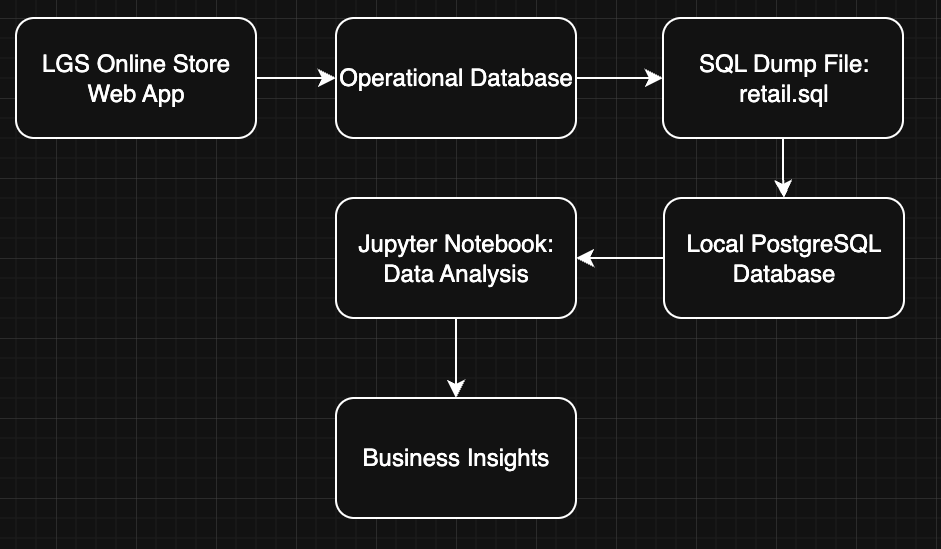

# Introduction

London Gift Shop (LGS) is an online giftware retailer in the UK. Although the company has been operating online for many years, its revenue growth has slowed down recently. To better understand customer shopping behaviour, LGS wants to use its historical transaction data to support more data-driven sales and marketing decisions.

The goal of this project is to analyze LGS customer purchase data and generate useful business insights for the marketing team. These insights can help LGS design more targeted marketing campaigns, such as email promotions, customer retention campaigns, seasonal sales events, and product-specific promotions for both new and existing customers.

In this project, I worked as a data engineer to complete a proof-of-concept analytics solution. The transaction data was loaded from a SQL dump into a PostgreSQL database, which acted as the data warehouse for this project. I then used Python, Jupyter Notebook, Pandas, NumPy, and Matplotlib to extract, clean, transform, analyze, and visualize the retail data. The final analysis results were delivered through a Jupyter Notebook and version-controlled using Git and GitHub.

# Implementaion
## Project Architecture

The LGS online store collects customer transaction data from its web application. When customers place orders through the web app, the transaction records are stored in the company’s operational database. Since this project is a proof of concept, I did not work directly in the LGS production environment. Instead, the historical transaction data was provided as a SQL dump file.

For this project, the SQL dump was loaded into a PostgreSQL database, which served as the local data warehouse. The data was then accessed from a Jupyter Notebook using Python. I used Pandas and NumPy to clean, transform, and analyze the transaction data, and Matplotlib to create visualizations. The final analytics results were documented in the notebook and pushed to GitHub as the project deliverable.

The overall architecture is shown below:

## Data Analytics and Wrangling

The main data analytics and wrangling work for this project is documented in the Jupyter Notebook below:

[retail_data_analytics_wrangling.ipynb](./retail_data_analytics_wrangling.ipynb)

In this notebook, I loaded the retail transaction data into a Pandas DataFrame and prepared it for analysis. The dataset was first explored using methods such as `head()`, `sample()`, `info()`, and `describe()` to understand the structure, data types, missing values, and basic statistical summary. I also renamed the columns into snake case format, converted columns to appropriate data types, created new calculated fields such as `total`, `sales_amount`, and `yyyymm`, and handled cancelled orders and negative transaction records.

The analysis includes several business-focused metrics and visualizations. I calculated invoice-level amount distribution and used both histogram and boxplot charts to understand the spending pattern and identify extreme values. I also compared monthly placed orders and cancelled orders, calculated monthly sales, monthly sales growth rate, and monthly active users. In addition, I separated customers into new users and existing users based on their first purchase month to help LGS understand customer acquisition and retention patterns.

I also performed RFM analysis to support customer segmentation. After removing cancelled orders and invalid sales records, I calculated each customer’s recency, frequency, and monetary value. Then I assigned RFM scores and grouped customers into segments such as Champions, Loyal Customers, Potential Loyalists, New Customers, At Risk, and Hibernating. This segmentation can help LGS understand which customers are most valuable and which customers may need re-engagement.

LGS can use these analytics results to increase revenue through more targeted marketing strategies. For example, monthly sales and sales growth trends can help the marketing team identify strong and weak sales periods and plan seasonal campaigns. The monthly placed and cancelled order comparison can help LGS monitor order quality and investigate months with unusual cancellation patterns. The new and existing user analysis can support different campaigns for customer acquisition and retention. For RFM segmentation, LGS can send loyalty rewards to Champions and Loyal Customers, welcome promotions to New Customers, and reactivation offers to At Risk or Hibernating customers.

Overall, this analysis helps LGS move from general marketing campaigns to more data-driven marketing decisions. Instead of sending the same promotion to all customers, LGS can use transaction patterns and customer segments to target the right customers with the right products at the right time.

# Improvements

If I had more time, I would improve this project in the following ways:

1. **Perform more targeted statistical analysis**

   The current analysis includes general distribution checks and high-level business summaries. With more time, I would perform more targeted statistical analysis based on specific business questions. For example, I could compare customer spending patterns across different countries, analyze whether certain months have significantly higher sales, or study the relationship between order quantity, unit price, and total revenue. This would help LGS make marketing decisions based on stronger evidence instead of only general trends.

2. **Investigate the data more deeply before creating visualizations**

   I would spend more time validating the data behind each chart to make sure the visualizations are accurate and representative. For example, I would further investigate cancelled orders, negative quantities, missing customer IDs, duplicated invoice records, and extreme outliers before drawing conclusions. This step is important because misleading or incomplete data can lead to incorrect business insights. A deeper data investigation would make the final analysis more reliable for the LGS marketing team.

3. **Develop an interactive dashboard**

   I would build an interactive dashboard using tools such as Tableau, Power BI, or Python-based dashboard libraries. The dashboard could allow users to filter results by time period, country, product, and customer segment. This would make it easier for the LGS marketing team to explore revenue trends, top-selling products, and customer shopping behaviour without reading through the full Jupyter Notebook.