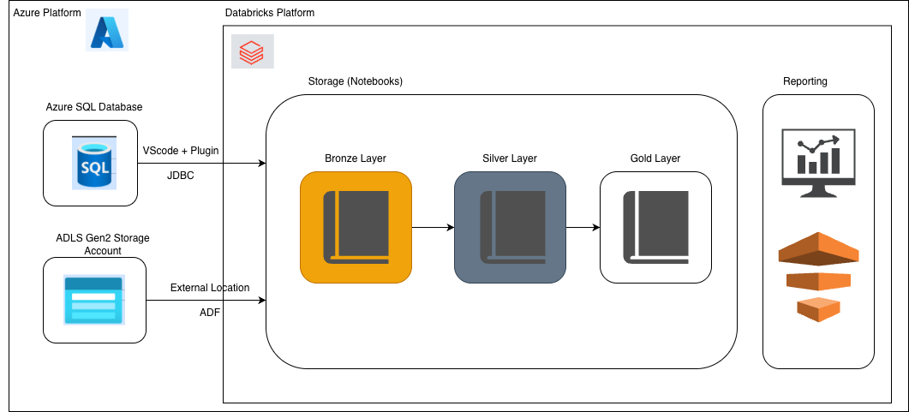
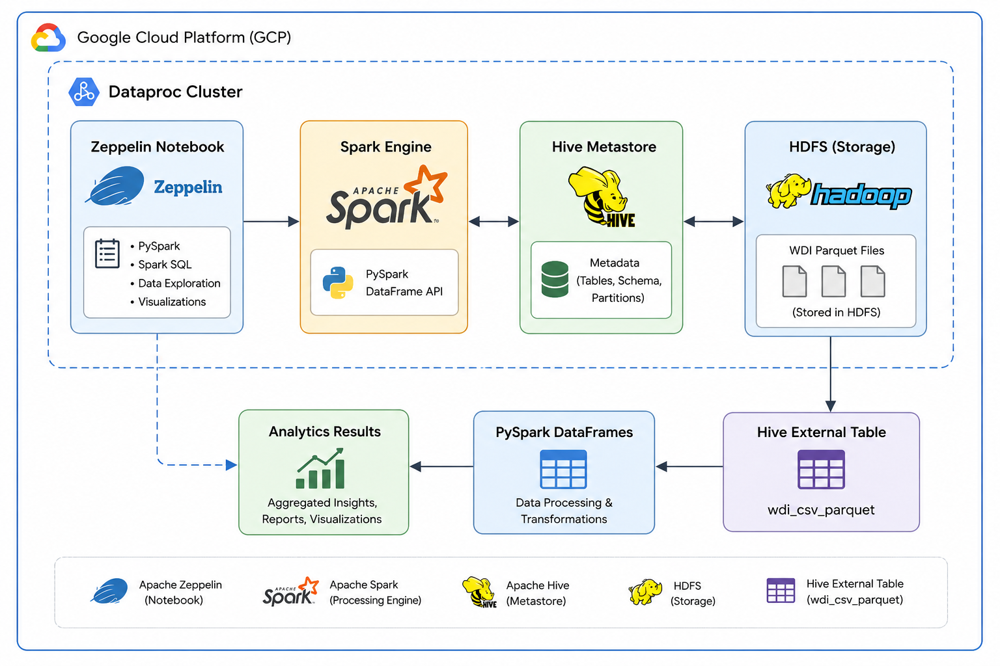

# Introduction
This project focuses on redesigning an existing data analytics workflow for the London Gift Shop (LGS), a retail business that uses customer and sales data to support marketing decisions. In the previous analytics solution, customer behavior and transaction data were analyzed with Python and Jupyter Notebook to help the marketing team better understand customer patterns and design more targeted campaigns. However, as the business expands and the volume of data grows, a single-machine notebook-based workflow becomes difficult to scale, maintain, and run efficiently.

To address this limitation, this project explores a big data processing solution using Apache Spark. The goal is to evaluate how Spark can support larger-scale data analytics by distributing computation across a cluster environment. In this project, I worked with PySpark to perform data processing and analysis using Spark Structured APIs, including DataFrame-based transformations and actions. The work was implemented and compared across two Spark environments: Apache Zeppelin running on a Hadoop-based setup, and Databricks running on Azure.

The main technologies used in this project include PySpark, Apache Spark, Spark DataFrames, Spark SQL, Zeppelin, Databricks, Hadoop, and Azure. The dataset used in the project comes from the London Gift Shop business scenario and is used to perform analytical tasks similar to those in the previous Python Data Analytics project, but with a more scalable distributed computing approach. Through this project, I practiced building Spark-based data analytics workflows, running notebooks in different environments, and comparing the usability and performance of Zeppelin and Databricks for big data analytics tasks.

# Databricks and Hadoop Implementation

## Dataset
The dataset used in this project is a financial transactions dataset desgined for analytics and fraud-related data enginnering practice. It contains multiple types of business data, including transaction records, card information, user demographic data, merchant category codes, and fraud labels. The dataset for this project can be found at the following link: [Financial Transactions Dataset: Analytics](https://www.kaggle.com/datasets/computingvictor/transactions-fraud-datasets).

The main data files include:
* `transactions_data.csv`: detailed transaction records, including transaction amounts, timestamps, merchant information, and related transaction attributes.
* `cards_data.csv`: credit and debit card information associated with users.
* `users_data.csv`: customer demographic information.
* `mcc_codes.json`: merchant category code information used to classify business types.
* `train_fraud_labels.json`: binary fraud labels indicating whether transactions are fraudulent or legitimate.

The analytics work focuses on building an ETL pipeline in Databricks to ingest, transform, and organize these datasets for downstream analysis. The pipeline follows the Medallion Architecture pattern, where raw data is first ingested into a Bronze layer, cleaned and standardized in a Silver layer, and then transformed into analysis-ready tables in a Gold layer.

## Architecture
This project uses Azure Databricks as the main platform for building and running the ETL pipeline. The overall architecture combines Azure cloud storage, Azure SQL Database, Databricks, PySpark, and Databricks workflow orchestration.

The data ingestion process uses different approaches depending on the source data format. CSV files such as transactions_data.csv and cards_data.csv are first uploaded into Azure SQL Database, then ingested into Databricks through JDBC and Lakeflow Connect. JSON files such as mcc_codes.json and train_fraud_labels.json, together with users_data.csv, are uploaded to Azure Data Lake Storage or Azure Blob Storage and then connected to Databricks through external locations and Azure Data Factory.

After the data is available in Databricks, PySpark is used to load the raw files or tables into Spark DataFrames. These DataFrames are then transformed through Spark Structured APIs and Spark SQL operations. The pipeline is organized using the Medallion Architecture:

* [Bronze layer](./notebook/bronze_financial_data.ipynb): stores raw ingested data from Azure SQL Database and Azure Storage.
* [Silver layer](./notebook/silver_financial_data.ipynb): stores cleaned, standardized, and joined datasets.
* [Gold layer](./notebook/gold_financial_data.ipynb): stores curated, business-ready tables for analytics and reporting.

Databricks provides the notebook environment, cluster execution engine, and workflow orchestration. DBFS and external locations are used to access files stored in cloud storage, while the Hive Metastore or Unity Catalog can be used to manage table metadata. Spark handles distributed data processing, allowing large transaction datasets to be processed more efficiently than a single-machine notebook workflow.

# Zeppelin and Hadoop Implementation
## Dataset
This project uses the World Development Indicators (WDI) dataset published by the World Bank. The dataset contains economic, social, and development indicators collected from countries around the world over multiple years. Each record includes information such as country name, country code, indicator name, indicator code, year, and indicator value.

The data was stored as Parquet files and loaded into a Hive table named `wdi_csv_parquet`. Using PySpark DataFrame APIs and Spark SQL, I performed exploratory data analysis on global development indicators and practiced common Spark operations including filtering, aggregation, grouping, sorting, joins, and DataFrame transformations.

The analytics work was completed in Apache Zeppelin notebooks running on a Hadoop-based environment. The notebook demonstrates how Spark can be used to process large-scale structured datasets in a distributed manner while leveraging Hive metadata and HDFS storage.

The implementation notebook can be found here: [WDI Analytics Notebook](./notebook/Spark%20Dataframe%20-%20WDI%20Data%20Analytics.json)

## Architecture
This project is built on a Hadoop ecosystem deployed through Google Cloud Platform (GCP) Dataproc. Apache Zeppelin serves as the notebook interface for developing and executing PySpark applications, while Apache Spark provides the distributed data processing engine.

The main components of the architecture include:

* Google Cloud Platform (GCP) – cloud infrastructure hosting the Dataproc cluster.
* Dataproc Cluster – managed Hadoop and Spark environment.
* HDFS (Hadoop Distributed File System) – distributed storage layer for Parquet files.
* Hive Metastore – metadata service used to manage table definitions.
* Apache Spark – distributed processing engine.
* PySpark DataFrame API – primary interface used for analytics and transformations.
* Apache Zeppelin – notebook environment used for development and execution.

This architecture demonstrates how Spark can integrate with Hadoop ecosystem components such as HDFS and Hive to perform scalable analytical workloads while providing an interactive notebook experience through Zeppelin.

# Future Improvement
- Databricks data ingestion process can be refined and updated
- The project could include stronger data quality checks and validation steps.
- The project could add automation and monitoring part.